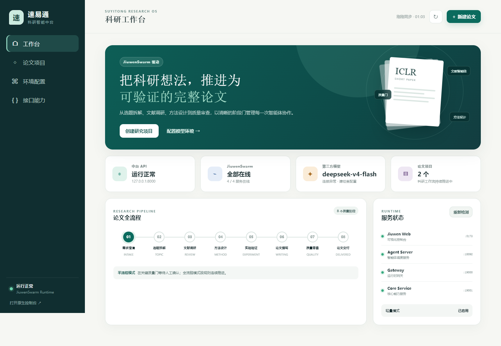

# 速易通（SuYiTong）

速易通是一个以 JiuwenSwarm 为智能体协作内核、面向 Agent 方向科研短论文的可追溯自动科研中台。



项目已从“文档先行”进入 **P1 技术验证与二次开发**：JiuwenSwarm v0.2.2 已完成源码部署、Web 构建和轻量化裁剪，速易通业务 API 已具备科研项目状态机与 SQLite 持久化。当前基线不包含 HarmonyOS 客户端开发。

## 已实现基线

- 官方 `JiuwenSwarm0.2.2`，锁定提交 `d7c2ab2f299cd2c73201afb41ebb8b9c00cc7015`；
- 第三方模型 API 路线，不要求本地模型或 GPU；
- 仅保留本地 Web 入口，禁用并卸载飞书、钉钉、企微、Telegram、Discord 等渠道 SDK；
- 速易通 FastAPI 业务层、科研项目创建/查询、阶段状态机和 SQLite 存储；
- PACM-SW 需求澄清与选题拆解垂直链路，支持真实模型生成、来源映射、运行留痕和人工质量门；
- PACM-SW 文献调研垂直链路，支持 OpenAlex/Crossref 双源检索、DOI/标题去重、证据编号约束综述和人工质量门；
- OpenAlex 用户密钥配置、脱敏状态、Bearer 认证检索、连通性与剩余额度检测；
- PACM-SW METHOD 垂直链路，支持分层记忆、溯源契约、检索公式、实验矩阵、证据映射和人工质量门；
- PACM-SW EXPERIMENT 垂直链路，支持预注册协议、五系统公平性约束、确定性预检、检索 Harness 试运行和禁止代理数据进入论文的质量门；
- 真实 B2/B3/PACM-SW 检索执行层，支持第三方 Embedding、BM25+dense RRF、四层可溯源记忆、角色/图/冲突/冗余/预算评分、本地向量缓存和逐运行 JSONL；
- B0/B1 生成基线、盲化人工 qrels、R1–R6 单变量消融、seeds 13/37/73 批量运行与逐回合 JSONL；
- 项目内隔离的虚拟环境、运行目录、启动脚本和冒烟测试。

比赛提交所需的作品简介、PPT 逐页内容、Demo 口播稿和脱敏产品截图见 [submission/README.md](submission/README.md)。

## 本地启动

首次或需要重建环境时：

```powershell
.\scripts\setup.ps1
```

参考 `config/jiuwenswarm.env.example`，在被 Git 忽略的 `runtime\.jiuwenswarm\config\.env` 中填写真实的 `API_BASE`、`API_KEY`、`MODEL_NAME` 和 `MODEL_PROVIDER`，然后分别在两个终端运行：

```powershell
.\scripts\start-jiuwenswarm.ps1
.\scripts\start-api.ps1
```

- JiuwenSwarm Web：<http://127.0.0.1:5173>
- 速易通科研工作台：<http://127.0.0.1:8000>
- API 文档：<http://127.0.0.1:8000/docs>

科研工作台提供运行状态总览、论文项目与质量门管理、第三方模型环境配置、密钥脱敏保存、模型连通性检测和 API 能力浏览。模型密钥只写入本机 `runtime/.jiuwenswarm/config/.env`；读取接口只返回“是否已配置”，不会回传密钥原文。

> 安全提示：不要把 `runtime/`、`.env`、数据库、JSONL 运行日志或包含认证 Header 的截图提交到 Git。公开仓库安全边界见 [SECURITY.md](SECURITY.md)。

## 当前目标

构建一条可支持全流程或半流程的人机协同科研链路：

> 选题拆解 → 文献调研 → 研究空白 → 方法设计 → 实验执行 → 结果分析 → 论文撰写 → 内部评审 → 质量门 → ICLR 风格交付

最终交付不只是论文 PDF，还包括 LaTeX、BibTeX、证据账本、实验代码与日志、质量门报告和可复现清单。

## 文档入口

完整文档索引见 [docs/README.md](docs/README.md)。

建议阅读顺序：

1. [项目章程](docs/00-project-charter.md)
2. [范围与需求基线](docs/01-scope-and-requirements.md)
3. [比赛研究方向与论文选题](docs/02-research-direction.md)
4. [总体系统架构](docs/03-system-architecture.md)
5. [科研工作流](docs/04-research-workflow.md)
6. [Agent、Skill 与工具设计](docs/05-agent-skill-tool-design.md)
7. [数据、上下文与记忆设计](docs/06-data-context-memory.md)
8. [质量门与论文交付规范](docs/07-quality-gates.md)
9. [实验与评测方案](docs/08-evaluation-plan.md)
10. [JiuwenSwarm 集成与二次开发边界](docs/09-jiuwenswarm-integration.md)
11. [开发路线与验收标准](docs/10-roadmap-and-acceptance.md)
12. [风险、合规与治理](docs/11-risk-compliance-governance.md)
13. [决策记录与待确认事项](docs/12-decisions-and-open-questions.md)
14. [资料来源](docs/13-references.md)
15. [开发环境与启动指南](docs/14-development-setup.md)
16. [PACM-SW 需求澄清与选题拆解垂直链路](docs/15-pacm-sw-vertical-slice.md)
17. [PACM-SW 可追溯文献调研垂直链路](docs/16-pacm-sw-literature-review.md)
18. [PACM-SW 方法设计基线](docs/17-pacm-sw-method-design.md)
19. [PACM-SW 实验验证模块](docs/18-pacm-sw-experiment.md)
20. [PACM-SW 真实检索执行器与 JSONL 记录层](docs/19-pacm-sw-real-retrieval.md)
21. [PACM-SW 正式基线、人工 Qrels 与消融批量运行](docs/20-pacm-sw-formal-benchmark.md)

## 当前阶段约束

- 暂不开发 HarmonyOS、移动端或端侧 NPU 推理。
- 模型统一通过可替换的第三方 API 调用；正式运行前必须在环境配置页通过模型与 Embedding 连通测试。
- 暂不实现无人工监督的论文自动发布或投稿。
- JiuwenSwarm v0.2.2 作为比赛开发基线，后续版本只作能力研究参考。
- 所有系统能力必须能够被评测、回放和审计。

## 文档版本

- 基线版本：v0.1
- 基线日期：2026-08-14
- 状态：P1 开发中
