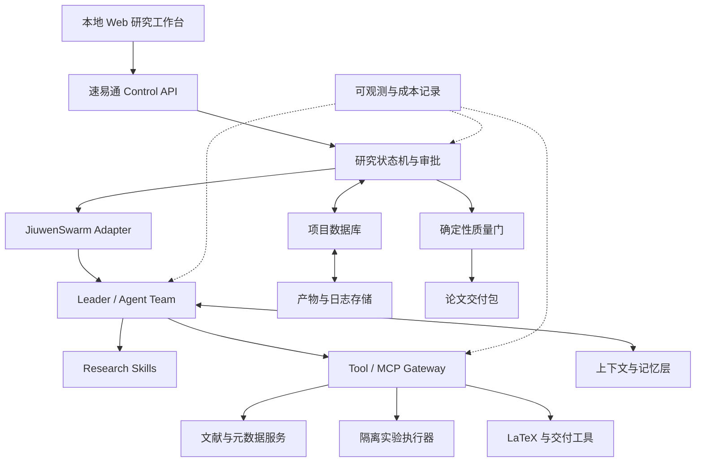

# 03 总体系统架构

## 1. 架构目标

总体架构需要同时满足四类目标：

- 支撑长流程、多阶段、多 Agent 科研任务；
- 保证证据、实验、论点和论文可追溯；
- 将动态智能体判断与确定性质量控制分离；
- 能够在本地开发环境中逐步实现，并保留未来服务化扩展能力。

## 2. 核心架构判断

JiuwenSwarm 适合作为智能体运行与协作内核，但不应承担速易通全部业务状态。速易通必须在其外部维护研究项目、阶段状态、产物版本、审批、质量门与交付清单。

原因如下：

- 聊天历史不适合作为研究项目的唯一事实源；
- 论文生成需要跨多次会话和长时间实验；
- Agent 的自然语言输出不能替代数据库约束和文件校验；
- 比赛评测需要稳定回放不同 Agent/记忆方案；
- JiuwenSwarm 后续升级时，业务数据不能被其内部结构绑定。

## 3. 逻辑架构



## 4. 分层设计

### 4.1 交互层

首期只建设本地 Web 工作台和命令行管理入口。

主要页面：

- 项目创建与约束录入；
- 候选选题比较与审批；
- 文献、证据和 Claim 浏览；
- 实验计划、运行状态和结果；
- 论文预览和版本差异；
- 质量门报告和修订任务；
- Agent 运行轨迹、Token 和费用。

交互层不直接调用单个 Agent，所有请求先进入 Control API 和状态机。

### 4.2 控制中台层

控制中台是速易通的业务核心，负责：

- 项目和成员权限；
- 研究状态机；
- 阶段输入与输出契约；
- 人工审批和驳回；
- 任务调度、重试和取消；
- 产物版本与依赖；
- 质量门执行；
- 交付包生成。

### 4.3 智能体适配层

封装 JiuwenSwarm 的具体调用方式，向上提供稳定接口：

```text
create_team(project_id, team_profile)
run_stage(project_id, stage, input_artifacts)
pause_run(run_id)
resume_run(run_id)
cancel_run(run_id)
collect_trace(run_id)
propose_evolution(run_id)
```

适配层负责把速易通的结构化任务转换为 JiuwenSwarm Leader/Team 可执行的任务，并将结果还原为结构化产物。

### 4.4 Agent 运行层

使用 JiuwenSwarm 承担：

- Leader 任务分解与团队协调；
- 多角色 Agent 执行；
- Skill 加载与调用；
- 工具选择和调用；
- 上下文压缩与记忆召回；
- 候选自演进信号收集；
- 需要时的人机中断与恢复。

Agent 不直接决定项目阶段完成。其输出必须经过 schema 校验、质量规则和状态机准入检查。

### 4.5 工具服务层

工具服务是可验证的原子能力，包括：

- 文献检索、DOI/arXiv 元数据验证；
- PDF/HTML/LaTeX 文本解析；
- 去重、引用格式化和 BibTeX 生成；
- 数据集登记、下载和校验和；
- Git、代码构建、测试和实验执行；
- 统计检验和图表数据生成；
- LaTeX 编译、页数、文件大小和匿名化检查；
- 质量门规则执行。

工具输出必须机器可读，错误不得被 Agent 吞掉或改写为成功。

### 4.6 数据与记忆层

分为三个层次：

1. **业务事实数据**：项目、状态、审批、产物、运行和质量报告；
2. **研究知识数据**：Evidence、Claim、Experiment、Decision 及关系；
3. **Agent 记忆数据**：角色偏好、会话摘要、团队经验和技能演进候选。

业务事实和研究知识由速易通存储；Agent 记忆可以使用 JiuwenSwarm 内置或外部记忆实现。

### 4.7 实验执行层

实验执行器应与 Agent 进程隔离，至少具备：

- 独立工作目录；
- CPU、内存、磁盘、时间和 GPU 限额；
- 默认关闭或限制网络；
- 依赖锁定和环境快照；
- 标准输出、错误和退出码采集；
- 数据只读挂载与结果目录写权限；
- 可取消和超时终止。

### 4.8 质量与交付层

质量门是独立于 Agent 的规则引擎。每次执行返回：

```json
{
  "profile": "iclr_short_paper",
  "status": "blocked",
  "checks": [],
  "warnings": [],
  "blocking_issues": [],
  "artifact_versions": {}
}
```

最终交付包由 manifest 固定所有文件、版本、哈希和生成时间。

## 5. 建议技术组件

以下为首选方案，尚未冻结：

| 能力 | 首选 | 备选/说明 |
|---|---|---|
| 后端 API | Python 3.11 + FastAPI | 与 JiuwenSwarm/OpenJiuwen 技术栈一致 |
| 业务数据库 | PostgreSQL | 本地技术验证可先用 SQLite，但接口按 PostgreSQL 设计 |
| 向量能力 | pgvector | 便于与业务数据事务一致；可替换独立向量库 |
| 产物存储 | 本地文件系统抽象 | 后续可换 MinIO/S3 |
| 缓存与队列 | Redis | 首个纵向切片可暂不引入 |
| 实验隔离 | Docker/兼容容器运行时 | Windows 本地环境需验证可用性 |
| 论文构建 | 官方 ICLR LaTeX 模板 + latexmk | 生成与编译必须固定镜像版本 |
| 版本控制 | Git | 代码、Prompt、Skill、模板和文档均版本化 |
| 可观测性 | 结构化日志 + OpenTelemetry 兼容模型 | 首期至少实现 trace_id/run_id |

## 6. 项目状态权威

项目状态只能由状态机修改。Agent 可以提出 `stage_completion_proposal`，但不能直接把阶段设为完成。

状态变更必须同时满足：

- 必需产物存在；
- 产物 schema 验证通过；
- 阶段质量门通过；
- 必需审批已完成；
- 依赖版本未发生未处理变化。

## 7. 事件模型

建议所有重要动作产生不可变事件：

```text
ProjectCreated
StageStarted
AgentRunStarted
ToolCallCompleted
ArtifactCreated
ArtifactSuperseded
QualityGateFailed
ApprovalRequested
ApprovalGranted
StageCompleted
EvolutionProposed
DeliveryBuilt
```

事件用于审计和回放，但当前状态仍保存在业务表中，不要求首期实现完整 Event Sourcing。

## 8. 幂等与重试

- 每个阶段执行使用唯一 `stage_run_id`。
- 工具调用具备 `idempotency_key`，下载、索引和编译避免重复。
- 模型调用失败可重试，但不得把多个不同回答静默混合成同一产物。
- 实验失败保留原始运行，新运行生成新的 `experiment_run_id`。
- 任何重试都记录原因、次数、参数和最终结果。

## 9. 本地部署边界

首期本地部署包含：

- 速易通 Control API；
- 本地 Web 工作台；
- JiuwenSwarm v0.2.2 开发基线；
- PostgreSQL 或兼容本地数据库；
- 本地文件产物库；
- Docker 实验执行器；
- LaTeX 构建环境。

不要求首期实现多机分布式 Swarm，但接口和数据模型不能假定所有任务必须在单一进程内完成。

