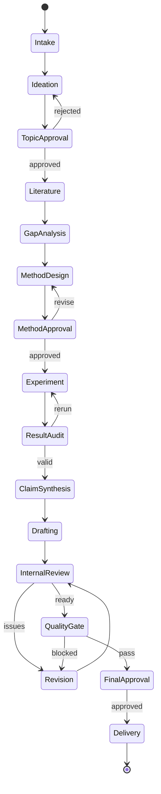

# 04 科研工作流

## 1. 工作流目标

科研工作流负责把开放式研究任务转化为受控阶段。每个阶段必须具有明确输入、输出、准入条件、失败路径和人工审批要求。

## 2. 状态总览

## 3. 阶段定义

### S0 Intake：任务受理

**目标**：建立研究约束和资源边界。

输入：比赛规则、Agent 方向、用户想法、页数、语言、时间、模型与算力。

输出：`research-brief.yaml` 初版。

必须记录：

- 目标问题与预期读者；
- 比赛/venue 配置；
- 自动化模式；
- 可使用的数据和代码；
- 算力、预算和截止时间；
- 禁止事项和伦理约束；
- 已知资料与未知信息。

通过条件：必填约束完整，无互相冲突的硬要求。

### S1 Ideation：候选选题

**目标**：把方向转化为可实验的候选研究题。

Agent 输出 3—5 个候选题，每个候选题必须包含：

- 问题定义；
- 预期贡献；
- 可证伪假设；
- 所需数据与算力；
- 主要基线；
- 新颖性风险；
- 最小可行实验。

禁止只生成标题或宣传性描述。

### H1 Topic Approval：选题审批

人工选择、合并、修改或拒绝候选题。审批结果记录理由。

未经批准不得进入大规模文献检索或实验。

### S2 Literature：文献调研

**目标**：建立覆盖研究问题、方法、基线和评测的证据集合。

流程：

1. 根据研究问题生成不同粒度查询；
2. 从合规数据源获取候选文献元数据；
3. 标题、作者、年份、DOI/arXiv ID 规范化与去重；
4. 评估与研究问题的相关性；
5. 在访问许可允许时提取证据片段；
6. 记录来源位置和用途；
7. 形成相关工作主题图和未覆盖问题。

输出：`evidence-ledger.jsonl`、检索报告、文献覆盖报告。

### S3 Gap Analysis：研究空白

**目标**：从文献证据中得出研究空白，而不是从模型常识直接生成“创新点”。

每项研究空白应包含：

- 已有方法做了什么；
- 在什么条件下不足；
- 哪些文献共同支持该判断；
- 该不足是否能被当前项目实验验证；
- 可能推翻该空白的反证。

输出：`gap-analysis.yaml` 和更新后的研究假设。

### S4 Method Design：方法与实验设计

**目标**：形成可执行、可对照的研究方案。

输出必须包括：

- 方法定义及组成部分；
- 输入输出和算法流程；
- 对照系统；
- 消融变量；
- 数据集与划分；
- 自动指标和人工指标；
- 随机种子和重复次数；
- 显著性或不确定性处理；
- 停止条件；
- 失败条件和资源预算。

### H2 Method Approval：方法审批

人工确认：

- 研究问题是否仍然成立；
- 实验是否能够检验假设；
- 资源是否可承受；
- 数据和许可是否合规；
- 是否需要缩小或调整范围。

### S5 Experiment：实验执行

**目标**：按已批准计划运行真实实验。

执行要求：

- 使用锁定环境；
- 保存代码提交、配置和数据校验和；
- 每个运行生成独立目录；
- 保存标准输出、错误、退出码、用时和资源；
- 原始结果不可被后续运行覆盖；
- 失败运行同样进入 Experiment Ledger。

高成本、联网、安装新依赖、写外部服务等操作按权限策略审批。

### S6 Result Audit：结果审计

**目标**：判断实验是否有效，而不是立即寻找支持预设观点的解释。

检查：

- 是否按计划完成全部基线和消融；
- 是否存在缺失运行或异常值；
- 指标计算是否一致；
- 重复运行方差是否可接受；
- 是否存在数据泄漏；
- 结论是否超过实验覆盖范围；
- 负面或不显著结果是否被保留。

结果无效时回到 Experiment；假设不成立时可以回到 Gap Analysis 或终止课题。

### S7 Claim Synthesis：论点合成

**目标**：先建立 Claim Ledger，再撰写论文。

每个 Claim 包含：

- Claim 文本；
- 类型：事实/实验结果/推断/限制；
- 支撑 Evidence 和 Experiment；
- 支撑强度与反证；
- 可使用章节；
- 允许的表述强度；
- 状态：草案/批准/驳回/过期。

### S8 Drafting：论文撰写

**目标**：从已批准研究产物生成 ICLR 风格论文。

写作顺序建议：

1. 贡献与结果表；
2. 方法；
3. 实验设置；
4. 结果与分析；
5. 相关工作；
6. 引言；
7. 摘要；
8. 局限、伦理和 LLM 使用说明。

写作 Agent 只能引用 Evidence Ledger 中已验证条目，只能使用 Experiment Ledger 中的真实指标。

### S9 Internal Review：内部评审

至少覆盖以下审稿视角：

- 新颖性和相关工作；
- 方法正确性；
- 实验与统计严谨性；
- Claim-Evidence 一致性；
- 写作清晰度与复现性。

审稿输出必须转化为具体修订任务，每个问题指向章节、Claim、Evidence 或 Experiment。

### S10 Revision：修订

修订不得直接覆盖已交付版本。每轮生成新的论文版本和变更摘要：

- 修订了什么；
- 为什么修订；
- 使用了哪些新证据或实验；
- 哪些审稿意见未采纳及原因。

### S11 Quality Gate：质量门

执行确定性规则和必要的模型辅助规则。阻断级失败返回 Revision 或更早阶段。

### H3 Final Approval：最终审批

人工确认：

- 结论与证据相符；
- 作者身份、致谢和 LLM 使用说明正确；
- 匿名版不存在身份泄漏；
- 交付包不包含无权分发的数据或论文全文；
- 允许生成最终交付。

### S12 Delivery：交付

生成带哈希的 `manifest.json`，锁定论文、代码、实验、证据、审稿和质量报告版本。

外部 Stanford Agentic Reviewer 评测首期由用户人工上传，返回结果可作为新的评审输入，但不自动改变原始实验事实。

## 4. 半流程入口

| 用户已有内容 | 建议入口 | 必做补充检查 |
|---|---|---|
| 已有研究题 | S2 Literature | 检查可实验性与范围 |
| 已有文献 | S2 Literature | 元数据验证、去重、证据位置 |
| 已有方法 | S4 Method Design | 补齐基线、消融和停止条件 |
| 已有代码/结果 | S5/S6 | 环境、数据、日志和结果真实性 |
| 已有论文草稿 | S7/S8 | 反向建立 Claim/Evidence/Experiment Ledger |
| 只有 PDF | S9 Internal Review | 解析质量、引用核验和缺失产物说明 |

## 5. 终止与降级

项目允许得出“当前资源下无法形成可靠论文”的结果。可终止原因包括：

- 研究问题与已有工作高度重复；
- 无法获得合规数据或实验资源；
- 核心假设在小规模实验中不成立；
- 结果无法复现；
- 剩余时间不足以补齐必要实验；
- 风险或伦理问题无法接受。

终止应输出研究记录和失败原因，而不是强制生成论文。

