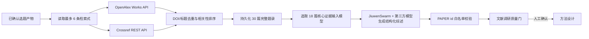

# PACM-SW 可追溯文献调研垂直链路

- 文档状态：已实现，待人工质量门评审
- 实现日期：2026-08-15
- 对应阶段：`literature_review`

## 1. 目标与边界

本链路承接已经人工确认的选题拆解产物，以其中的英文检索式为唯一查询入口，完成“真实学术元数据检索 → 去重与排序 → 证据约束综述 → 引用编号校验 → 人工质量门”。模型不能自行补充文献，生成内容只能引用本轮持久化的 `PAPER-xxx`。

本阶段产物是方法设计的证据输入，不等于已经完成系统综述，也不替代全文审读。未检索到直接工作只能记为“证据不足”，不能推导为“研究空白已被证明”。

## 2. 运行流程

## 3. 确定性能力与模型能力分工

确定性代码负责：

- 从已确认选题读取查询，禁止脱离上游产物自由改题；
- 请求 OpenAlex 与 Crossref 的公开学术元数据；
- 清洗 HTML、恢复 OpenAlex 摘要、规范化 DOI；
- 以 DOI 优先、标准化标题兜底去重；
- 以查询词重合、领域锚点、数据源相关性和有限被引信号排序；
- 持久化论文题录、查询来源、运行轨迹和失败原因；
- 删除主题、论断和 Related Work 中不存在于本轮检索的 PAPER 编号；
- 未获人工确认前保持项目阶段不变。

模型负责：

- 主题聚类与研究脉络归纳；
- 从摘要证据中提取发现、矛盾和候选研究缺口；
- 为每条论断标注证据编号、验证状态和置信度；
- 生成带 `[PAPER-xxx]` 临时引用的 Related Work 草稿；
- 生成对下一阶段方法设计的约束与启示。

## 4. 数据契约

每篇 `PaperRecord` 至少保存：题名、作者、年份、来源、DOI、URL、摘要、被引数、数据源记录 ID、命中查询和相关性分数。每条 `EvidenceClaim` 保存：论断、PAPER 编号集合、验证状态与置信度。

模型只接收排序前 18 篇的紧凑证据字段，以控制上下文和结构化输出稳定性；完整 30 篇题录仍单独保存在运行记录并展示在工作台。模型输出经过 Pydantic 契约验证，兼容部分 OpenAI-compatible 模型把文本列表或文本字段返回为语义对象的情况。

## 5. API

| 方法 | 路径 | 作用 |
|---|---|---|
| GET | `/api/v1/projects/{project_id}/literature-review/runs/latest` | 读取最近一次运行及失败轨迹 |
| POST | `/api/v1/projects/{project_id}/literature-review/runs` | 执行真实检索和证据综述 |
| POST | `/api/v1/projects/{project_id}/literature-review/confirm` | 人工确认并推进到方法设计 |

## 6. 本次真实运行验收

项目“面向长上下文任务的分层记忆检索方法。”在 2026-08-15 已成功完成运行 `03870aec-7c86-4fb3-b34c-1a60e96f9e5e`：

| 指标 | 结果 |
|---|---:|
| 查询数 | 6 |
| 去重后题录 | 30 |
| 含 DOI | 30 |
| 含摘要 | 20 |
| 数据源 | OpenAlex、Crossref |
| 生成模型 | deepseek-v4-flash |
| 主题 / 关键发现 / 缺口 | 4 / 6 / 3 |
| 模型 token | 6,982 |
| 状态 | 已生成，待人工质量门确认 |

自动化测试覆盖选题门前置条件、真实题录形态、证据编号白名单、模型输出形态兼容和确认后阶段推进；当前全套测试为 11 项通过。

## 7. 人工质量门检查顺序

1. 优先打开题名高度贴近 PACM-SW 的 2025–2026 论文，核验 DOI、出版状态和摘要是否真实一致。
2. 检查 PAPER-017/PAPER-018 是否为同一工作的不同版本，不能重复计作独立证据。
3. 对所有 `title_level_only` 或低置信度论断补读全文，不能进入最终论文的强结论。
4. 扩充“multi-agent scientific writing”“collaborative academic writing agent”等查询，专门验证 H3。
5. 人工确认后才允许项目进入 `method_design`，并冻结本轮证据快照以供回放。

## 8. 已知限制与下一步

- 当前是元数据与摘要级调研，尚未实现 PDF 全文下载、分块解析和段落级引用定位。
- Crossref 与 OpenAlex 提供的是检索入口与元数据，不代表论文经过平台二次学术真实性背书。
- 下一迭代应加入时间范围、文献类型、开放获取状态等筛选器，并支持人工增删核心文献。
- 质量门通过后，方法设计只能继承“已验证”或“部分支持”的缺口；证据不足项继续作为检索任务，不能变成既定创新结论。

## 9. OpenAlex 认证配置

环境配置页面提供独立的 OpenAlex 配置卡。用户输入的密钥保存为本机运行目录中的 `OPENALEX_API_KEY`，读取配置时只返回 `has_openalex_api_key` 布尔状态，不回传原文。空值更新会保留现有密钥。

速易通使用 `Authorization: Bearer <key>` 请求头调用 OpenAlex，避免把密钥写入 URL、浏览器存储或普通访问日志。保存后无需重启 API，下一次文献调研会动态读取最新密钥。`POST /api/v1/system/openalex/test` 会执行一条最小 Works 查询，并在 OpenAlex 返回限额响应头时显示当日总额度与剩余额度。

配置与验证顺序：

1. 打开“环境配置 → OpenAlex 学术检索”。
2. 输入 API Key 并点击“保存环境配置”。
3. 点击“检测 OpenAlex”。
4. 页面显示“连接正常”后，重新运行文献调研以生成新的认证检索快照。
